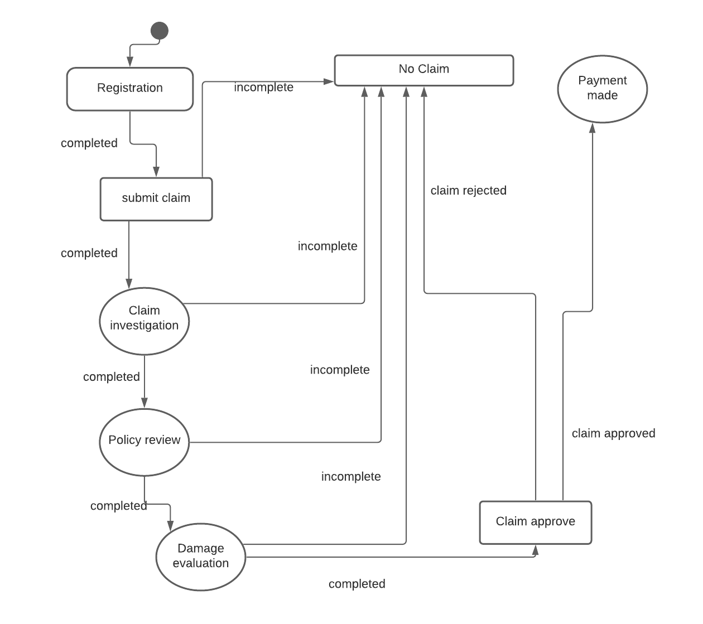

## State Diagram


## state data 
```
	States: [“No claim”, “Registration”, “Claim investigation”, “Policy review”,” Damage Evaluation”, ”Claim approve”, “Claim”]
	State:0
	Name: “”
	Policy Number: “”
	Vehicle Data: { 
        make: “”,
        year: ””, 
        registration: ””,
        licence plate number: ””
        }
	Accident Data:{
        Date: ””,
        Time: ””,
        Location: “”,
        Extent of injuries: ””,
        Number of passengers involved: ””,
        Extent of damage to the vehicle: ””,
        Accident Description: ””,
        Names of the drivers involved:[”Driver 1”,"Driver 2"],Driver Data:  { Name:"",
                        licence number:"",	
                        Name of the insurance company:””,Auto insurance policies:"" involved:””
                        }
        }
	Investigating officer:{ Name:””,
                            Batch number:””
                          }
```

# Identify the transition functions 

## Transitions
	SubmitClaim(Name,PolicyNumber, DriverSLicenceNumber, LicensePlateNumber)
	Incomplete (Name,PolicyNumber)
	Rejected (Name,PolicyNumber)
	Approved (Name,PolicyNumber)
	Claim((Name,PolicyNumber)
    
## Functions
    SubmitClaim 
    investigateClaim
    evaluateDamage 
    ApproveClaim
    RejectClaim

## Identify roles 
   Functions |Roles
   ---------- |----------
   | SubmitClaim        | Policy Owner |
   | investigateClaim     | Investigating officer
   | evaluateDamage | Insurance Company, Investigating officer
   | claimApproval      | Insurance Company,System
   | RejectClaim        | Insurance Company,System


